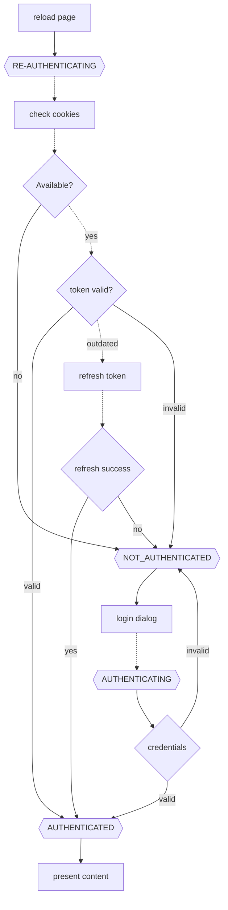

```mermaid
flowchart
loadPage[reload page]
re-authenticating{{RE-AUTHENTICATING}}
not_authenticated{{NOT_AUTHENTICATED}}
authenticated{{AUTHENTICATED}}
authenticating{{AUTHENTICATING}}
doLogin[login dialog]
presentContent[present content]
credentials{credentials}

checkCookies[check cookies]
cookies{Available?}

cookies_valid{token valid?}
refreshToken[refresh token]
refreshSuccess{refresh success}

loadPage --> re-authenticating
re-authenticating -.-> checkCookies

checkCookies -.-> cookies
cookies -->|no| not_authenticated
cookies -.->|yes| cookies_valid
cookies_valid -->|valid| authenticated
cookies_valid -.->|outdated| refreshToken
cookies_valid -->|invalid| not_authenticated
refreshToken -.-> refreshSuccess
refreshSuccess -->|yes| authenticated
refreshSuccess -->|no| not_authenticated


not_authenticated --> doLogin
doLogin -.-> authenticating
authenticating --> credentials
credentials -->|valid| authenticated
credentials -->|invalid| not_authenticated
authenticated --> presentContent
```