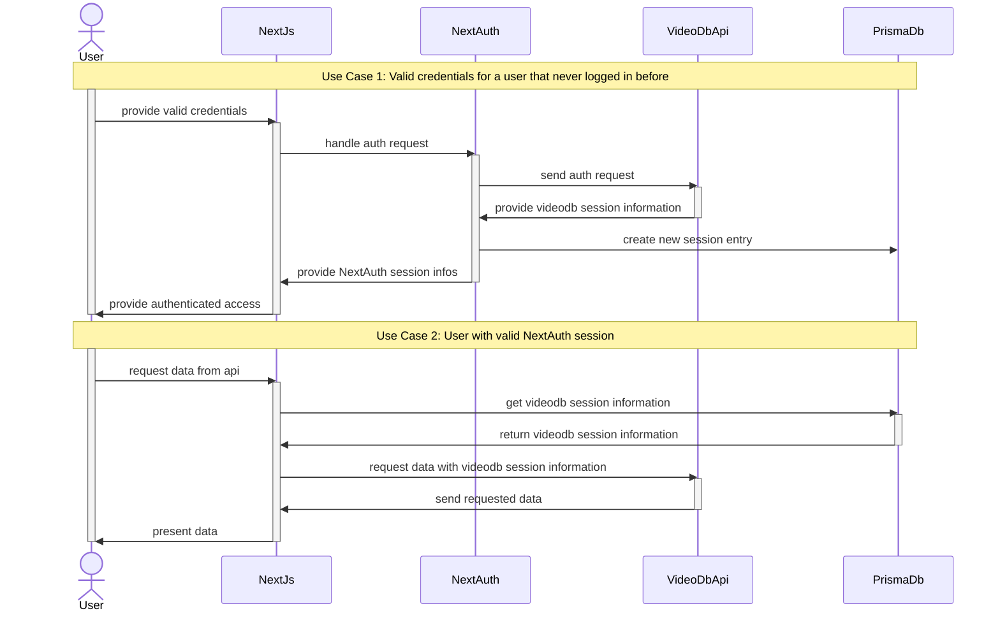

```mermaid
sequenceDiagram
  actor User
  participant NextJs
  participant NextAuth
  participant VideoDbApi
  participant PrismaDb

  note over User, PrismaDb: Use Case 1: Valid credentials for a user that never logged in before
  activate User
  User->>NextJs: provide valid credentials
  activate NextJs
  NextJs ->> NextAuth: handle auth request
  activate NextAuth
  NextAuth ->> VideoDbApi: send auth request
  activate VideoDbApi
  VideoDbApi ->> NextAuth: provide videodb session information
  deactivate VideoDbApi
  NextAuth ->> PrismaDb: create new session entry
  NextAuth ->> NextJs: provide NextAuth session infos
  deactivate NextAuth
  NextJs ->> User: provide authenticated access
  deactivate NextJs
  deactivate User

  note over User, PrismaDb: Use Case 2: User with valid NextAuth session
  
  activate User
  User->>NextJs: request data from api
  activate NextJs
  NextJs->>PrismaDb: get videodb session information
  activate PrismaDb
  PrismaDb->>NextJs: return videodb session information
  deactivate PrismaDb
  NextJs->>VideoDbApi: request data with videodb session information
  activate VideoDbApi
  VideoDbApi->>NextJs: send requested data
  deactivate VideoDbApi
  NextJs->>User: present data
  deactivate NextJs
  deactivate User


```